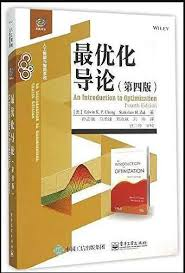
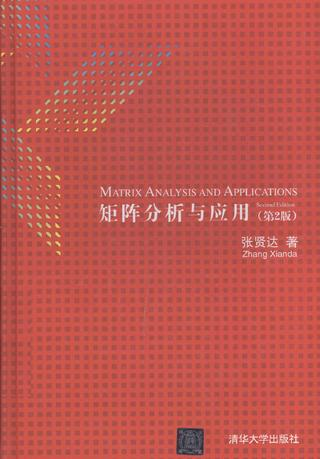
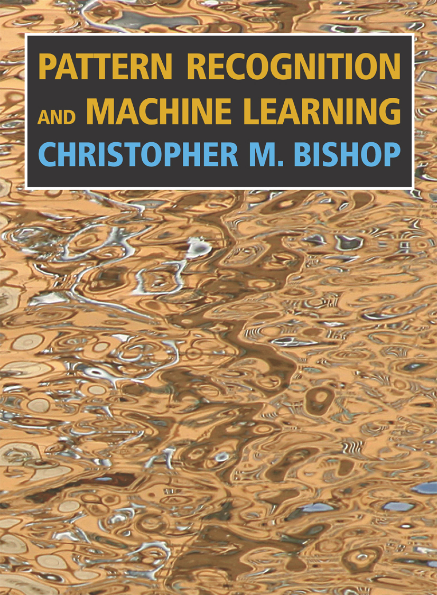
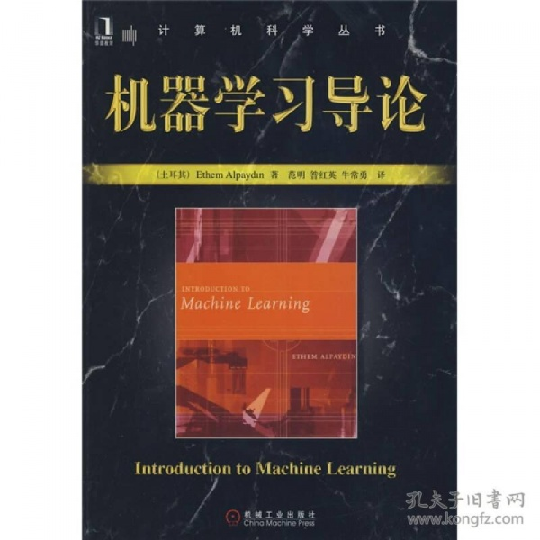

Python实现常见的机器学习算法

Learn ML algorithm with python!   

​		这是一个用Python实现常见的机器学习算法的仓库，本仓库将实现常见的机器学习算法，摒弃且每一种算法都在一个开源数据集上测试效果。理论知识可参考李航老师的《统计学习方法》、以及《Pattern Recognition  and Machine Learning》。

​        动手实现机器经典的学习算法有助于提高自己的编码能力，加深对算法原理的理解。但是要使用机器学做各种更加复杂的工作，那么应该学习机器学习库的使用。推荐使用《Hand-on machine earning with Scikit-Learn Keras & TensorFlow》

​        本仓库还会上传一些机器学习相关的其他书籍，包括数学基础相关的数据。

​        目主要着手于实现各种常见的机器学习算法；未来希望能将机器学习算法在文本挖掘以及自然语言处理领域的应用总结成另一个仓库。

​        欢迎对机器学习感兴趣的朋友参与到仓库的建。testbranch

## _参考书籍_

- [《最优化导论》](/Books/An_Introduction_to_Optimization.pdf)

  

- [《矩阵分析与应用》](/Books/矩阵分析与应用第二版.pdf)

  

* [《统计学习方法》](/Books/统计学习方法（第2版）.pdf)

     

* [《Pattern Recognition and Machine Learning》](Books/Pattern_Recognition_and_Machine_Learning.pdf)

     

* [《机器学导论》](/Books/Introduction_to_machine_learing（2nd）.pdf)

     

* [《Hands-On_Machine_Learning_with_Scikit-Learn,_Kera》](Books/Hands-On_Machine_Learning_with_Scikit-Learn,_Kera.pdf)

     

     

     

     

     

     

     

     

     

     

***

## _依赖库_

|     库名     |  版本  |
| :----------: | :----: |
|    Python    | 3.7.4  |
|  matplotlib  | 3.1.1  |
|    numpy     | 1.17.2 |
| scikit-learn | 0.22.2 |
|    scipy     | 1.4.1  |

## _目录_

### ***1.线性回归模型***

   - [算法原理]()

### ***2.EM算法与高斯混合模型***

   - [算法原理]()

   - [代码实现](GMM-EM/GussianMixture.py)

### ***3.聚类模型***

- [算法原理]()
- [K-means算法实现](Clustering/K-means.py)

### ***4.降维模型***

- [算法原理]()
- [PCA算法实现](Dimentionality Reduction/PCA.py)

### ***5.SVD 矩阵分解***

- [算法原理]()
- [算法实现]()

